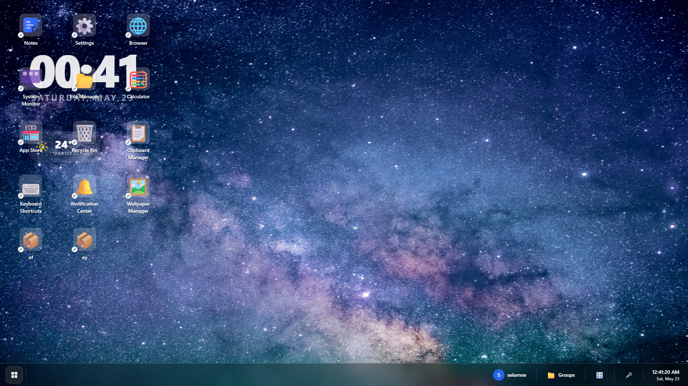
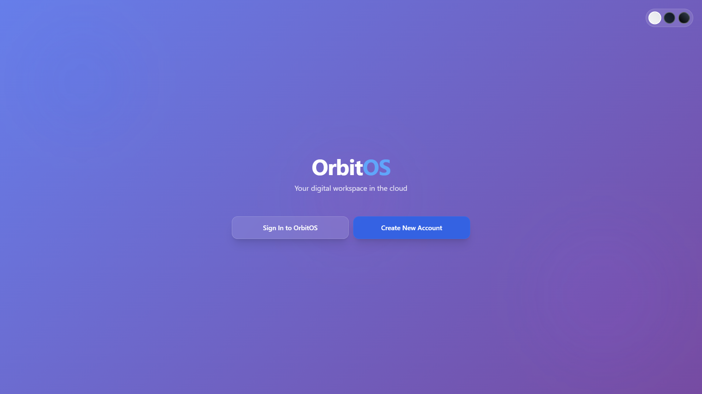

# Web OS Project

A Web OS-style application built with Next.js and Node.js for group collaboration. Features a desktop-like interface with draggable windows, a taskbar, and multiple applications.

## � Table of Contents

- [Screenshots](#-screenshots)
- [Features](#features)
- [Live Demo](#-live-demo)
- [Tech Stack](#tech-stack)
- [Project Structure](#project-structure)
- [Setup Instructions](#setup-instructions)
- [Available Scripts](#available-scripts)
- [API Endpoints](#api-endpoints)
- [Applications](#applications)
- [Customization](#-how-to-customize-the-look-and-feel)
- [Contributing](#contributing)
- [Deployment](#deployment)
- [Troubleshooting](#-troubleshooting)
- [Future Enhancements](#future-enhancements)
- [License](#license)

## �📸 Screenshots

### Homepage / Desktop Interface

*The main desktop interface with draggable windows, taskbar, and customizable wallpaper*

### Authentication

*Secure user authentication with login and registration*

## 🎨 How to Customize the Look and Feel

We've built a powerful theme and wallpaper system to make it easy to change how OrbitOS looks.

### Changing Colors & Styles (Theming)

All colors, fonts, and styles are controlled by **theme files**. This is the best way to change the look of the entire OS.

-   **Where to find them:** `src/themes/`
-   **Files to edit:** `lightTheme.js` and `darkTheme.js`

**Example: Editing the Taskbar Transparency**

Open `src/themes/darkTheme.js` and find the `taskbar` property:

```javascript
// src/themes/darkTheme.js
export const darkTheme = {
  // ...
  taskbar: 'bg-black/30 backdrop-blur-lg border-t border-white/20',
  // ...
};
```

-   `bg-black/30`: This is the color and transparency (black with 30% opacity). Change to `bg-black/50` to make it less transparent.
-   `backdrop-blur-lg`: This is the "frosted glass" effect. Change to `backdrop-blur-xl` for more blur, or delete it for no blur.

You can change any color for any component (windows, buttons, text) in these files!

### Changing the Desktop Wallpaper

There are two simple steps to add a new wallpaper:

1.  **Add the Image:** Drop your new wallpaper image file into the `public/backgrounds/` folder.
2.  **Register the Image:** Open `src/context/SettingsContext.js` and add the path to your new image to the `defaultWallpapers` array.

```javascript
// src/context/SettingsContext.js
const defaultWallpapers = [
  '/backgrounds/orbitos-default.jpg',
  '/backgrounds/nebula.png',
  '/backgrounds/my-new-cool-wallpaper.jpg', // <-- Add your new wallpaper here
];
```

The new wallpaper will now appear in the Settings app automatically.

## Features

-   🖥️ **Desktop-like UI** with wallpaper background and window management
-   📱 **Draggable Windows** - Minimize, maximize, and close windows just like a real OS
-   📋 **Modern Taskbar** - Full-width glass-style taskbar with Start Menu and live clock
-   🔐 **User Authentication** - Secure login and registration with JWT tokens
-   📝 **Built-in Applications** - Notes, Browser, Settings, File Manager, and more
-   🔗 **RESTful API** - Complete backend for user and file management
-   ⚡ **Real-time State Management** - Powered by React Context API
-   🎨 **Powerful Theme Engine** - Easily customize colors and styles from central theme files
-   🖼️ **Customizable Wallpapers** - Change desktop backgrounds from the Settings app
-   💾 **MongoDB Integration** - Persistent data storage with MongoDB Atlas
-   🌐 **Production Ready** - Fully deployable to Vercel with environment configuration
-   📱 **Responsive Design** - Works across different screen sizes

## 🚀 Live Demo

**Production URL:** [https://orbitos-web-os.vercel.app](https://orbitos-web-os.vercel.app)

Try it out and experience a full web-based operating system!

## Tech Stack

-   **Frontend**: Next.js 13+, React 18, Tailwind CSS, Framer Motion
-   **Backend**: Next.js API Routes (Serverless)
-   **Database**: MongoDB Atlas
-   **Authentication**: JWT (JSON Web Tokens) with HTTP-only cookies
-   **Language**: JavaScript
-   **State Management**: React Context API
-   **Deployment**: Vercel (Frontend & API), MongoDB Atlas (Database)

## Project Structure

```
web-os-project/
├── package.json
├── next.config.js
├── jsconfig.json
├── public/                 # For all static assets
│   ├── backgrounds/        # Desktop wallpapers live here
│   └── icon/
│       └── notes.png       # App icons live here
├── src/
│   ├── app-components/     # Home for app UI components
│   │   ├── browser.js
│   │   ├── notes.js
│   │   └── settings.js
│   ├── components/         # Core UI Components (Desktop, Taskbar, etc.)
│   │   ├── Desktop.js
│   │   ├── Taskbar.js
│   │   ├── Window.js
│   │   └── AppIcon.js
│   ├── context/            # React Context (Global State)
│   │   ├── AppContext.js
│   │   ├── SettingsContext.js
│   │   └── ThemeContext.js
│   ├── pages/              # Next.js routes (ONLY pages with URLs)
│   │   ├── _app.js
│   │   └── index.js        # The main desktop page
│   ├── styles/             # CSS files
│   │   └── globals.css
│   ├── system/             # For core OS logic and definitions
│   │   ├── apps/           # App definitions/handlers
│   │   │   ├── App.js
│   │   │   ├── BrowserApp.js
│   │   │   ├── NotesApp.js
│   │   │   └── SettingsApp.js
│   │   └── services/       # System-wide services
│   │       └── AppRegistry.js
│   ├── themes/             # THEME FILES (Edit all colors here)
│   │   ├── lightTheme.js
│   │   └── darkTheme.js
│   └── server/             # Express backend (unchanged)
│       ├── index.js
│       ├── routes/
│       └── db/
└── README.md
```

## Setup Instructions

### Prerequisites

-   Node.js 16+ installed
-   npm or yarn package manager
-   MongoDB Atlas account (free tier available)

### Installation

1.  **Clone the repository**
    ```bash
    git clone https://github.com/codehubbers/OrbitOS
    cd OrbitOS
    ```

2.  **Install dependencies**
    ```bash
    npm install
    ```

3.  **Configure Environment Variables**
    
    Create a `.env` file in the root directory:
    ```bash
    cp .env.example .env
    ```
    
    Update the `.env` file with your configuration:
    ```env
    # Database Configuration
    MONGODB_URI=your_mongodb_connection_string
    
    # JWT Secret Key (Generate a secure random string)
    JWT_SECRET=your_secure_jwt_secret_key
    
    # Environment
    NODE_ENV=development
    ```
    
    **Important:** 
    - Get your MongoDB URI from [MongoDB Atlas](https://cloud.mongodb.com/)
    - Generate a strong JWT_SECRET (use a random string generator)
    - Never commit your `.env` file to version control

4.  **Start the development server**
    ```bash
    npm run dev
    ```

5.  **Access the application**
    -   Application: http://localhost:3000
    -   API Routes: http://localhost:3000/api/*

## Available Scripts

-   `npm run dev` - Start Next.js development server (includes API routes)
-   `npm run build` - Build the Next.js application for production
-   `npm run start` - Start Next.js production server
-   `npm run lint` - Run ESLint to check code quality

## API Endpoints

### Authentication

-   `POST /api/auth/register` - Register new user
-   `POST /api/auth/login` - User login
-   `POST /api/auth/logout` - User logout
-   `GET /api/auth/me` - Get current user info

### Users

-   `GET /api/users` - Get all users
-   `PUT /api/users/preferences` - Update user preferences

### Dashboard

-   `GET /api/dashboard/stats` - Get dashboard statistics
-   `GET /api/dashboard/widgets` - Get user widgets
-   `POST /api/dashboard/widgets` - Create new widget
-   `PATCH /api/dashboard/widgets/:id` - Update widget
-   `DELETE /api/dashboard/widgets/:id` - Delete widget

### Clipboard

-   `GET /api/clipboard` - Get clipboard items
-   `POST /api/clipboard` - Add clipboard item
-   `DELETE /api/clipboard/:id` - Delete clipboard item

### Shortcuts

-   `GET /api/shortcuts` - Get keyboard shortcuts
-   `POST /api/shortcuts` - Create new shortcut
-   `PATCH /api/shortcuts/:id` - Update shortcut
-   `DELETE /api/shortcuts/:id` - Delete shortcut

### Wallpapers

-   `GET /api/wallpapers` - Get wallpapers
-   `POST /api/wallpapers` - Upload wallpaper
-   `PATCH /api/wallpapers/:id` - Update wallpaper
-   `DELETE /api/wallpapers/:id` - Delete wallpaper
-   `POST /api/wallpapers/activate` - Set active wallpaper

## Applications

### Notes App

-   A feature-rich rich text editor with a professional, self-contained UI.
-   **Developer:** @Gordon.H
-   **Rich Text Formatting:** Includes support for headers, bold, italics, lists, and links.
-   **File System Integration:** Standalone file save (to `.html`) and load functionality using browser APIs.
-   **Advanced Editing Tools:** Features a toggleable find-and-replace panel.
-   **Dynamic UI:** A floating element displays a real-time word count, ensuring visibility regardless of window size.
-   **About Panel:** Includes an "About" modal with version and developer information.

### Browser App

-   Basic web browser with URL input
-   Uses iframe for web content display

### Settings App

-   System configuration interface
-   Theme, notifications, and auto-save settings

## Contributing

### For Group Members

1.  **Fork the repository** and create your feature branch
    ```bash
    git checkout -b feature/your-feature-name
    ```

2.  **Follow the coding standards**
    -   Use JavaScript (not TypeScript)
    -   Follow existing component structure
    -   Use Tailwind CSS for styling
    -   Keep components small and focused

3.  **Adding New Applications**

    This project uses a dynamic App Registry system. To add a new app, follow these three steps:

    **Step 1: Create the App's UI Component**
    -   Create your new app's React component inside the `src/app-components/` directory (e.g., `src/app-components/my-new-app.js`).

    **Step 2: Create the App Definition**
    -   In the `src/system/apps/` directory, create a new definition file (e.g., `MyNewApp.js`).
    -   Import the base `App` class and export a new instance with your app's metadata. The `component` key must be a unique string.
      ```javascript
      // src/system/apps/MyNewApp.js
      import App from './App';
      
      export default new App({
        id: 'mynewapp',
        name: 'My New App',
        icon: '🚀', // or '/icon/mynewapp.png'
        component: 'MyNewApp', // This is the unique key
      });
      ```

    **Step 3: Register the App**
    -   Open `src/system/services/AppRegistry.js`.
    -   Import your new app definition from Step 2.
    -   Add the imported app to the `this.apps` array.
      ```javascript
      // src/system/services/AppRegistry.js
      import MyNewApp from '../apps/MyNewApp'; // <-- Import it
      // ... other imports

      class AppRegistry {
        constructor() {
          this.apps = [
            // ... other apps
            MyNewApp, // <-- Add it to the list
          ];
        }
        // ...
      }
      ```
    -   Finally, open `src/components/Desktop.js`.
    -   Import your UI component from Step 1.
    -   Add it to the `appComponents` map, using the unique key from Step 2.
      ```javascript
      // src/components/Desktop.js
      import MyNewApp from '@/app-components/my-new-app'; // <-- Import it
      // ... other imports

      const appComponents = {
        // ... other components
        MyNewApp: MyNewApp, // <-- Map the key to the component
      };
      ```

4.  **API Development**
    -   Add new routes in `src/server/routes/`
    -   Follow RESTful conventions
    -   Include proper error handling
    -   Return consistent JSON responses

5.  **Testing Your Changes**
    ```bash
    npm run dev:all
    ```

6.  **Submit Pull Request**
    -   Ensure code works locally
    -   Write clear commit messages
    -   Include description of changes

### Code Style Guidelines

-   Use functional components with hooks
-   Implement proper error boundaries
-   Follow React best practices
-   Use semantic HTML elements
-   Ensure responsive design
-   Add proper accessibility attributes

## Deployment

### Deploying to Vercel (Recommended)

1.  **Prepare for Production**
    ```bash
    npm run build
    ```
    Ensure the build completes without errors.

2.  **Push to GitHub**
    ```bash
    git add .
    git commit -m "Ready for deployment"
    git push origin main
    ```

3.  **Deploy to Vercel**
    - Go to [Vercel Dashboard](https://vercel.com/dashboard)
    - Click "New Project"
    - Import your GitHub repository
    - Configure Environment Variables:
      ```
      MONGODB_URI=your_mongodb_atlas_connection_string
      JWT_SECRET=your_secure_jwt_secret_key
      NODE_ENV=production
      ```
    - Click "Deploy"

4.  **Configure MongoDB Atlas**
    - Go to [MongoDB Atlas](https://cloud.mongodb.com/)
    - Navigate to "Network Access"
    - Click "+ ADD IP ADDRESS"
    - Select "ALLOW ACCESS FROM ANYWHERE" (0.0.0.0/0)
    - This allows Vercel's dynamic IPs to connect

5.  **Test Your Deployment**
    - Visit your Vercel URL
    - Test registration and login
    - Verify all features work correctly

### Important Notes

- **Environment Variables**: Make sure all environment variables are set in Vercel dashboard
- **MongoDB Atlas**: Must whitelist all IPs (0.0.0.0/0) for Vercel to connect
- **Cookie Settings**: Already configured for production with `SameSite=Lax`
- **Build Cache**: If you encounter issues, clear the build cache in Vercel

For detailed deployment instructions, see `DEPLOYMENT_GUIDE.md`

## Future Enhancements

-   [x] **User authentication with JWT** ✅
-   [x] **Real database integration (MongoDB)** ✅
-   [x] **Dark/light theme switching** ✅
-   [x] **Notification system** ✅
-   [x] **Production deployment** ✅
-   [ ] File system with cloud storage integration
-   [ ] Real-time collaboration features
-   [ ] Plugin system for custom apps
-   [ ] Mobile responsive design improvements
-   [ ] More theme options (e.g., Solarized, Dracula, Nord)
-   [ ] Desktop notifications API integration
-   [ ] Multi-language support (i18n)
-   [ ] Progressive Web App (PWA) features
-   [ ] Keyboard shortcut customization UI
-   [ ] Window snapping and tiling
-   [ ] Virtual desktops/workspaces

## 🐛 Troubleshooting

### Common Issues

**"Server error during login"**
- **Cause**: MongoDB Atlas is blocking the connection
- **Solution**: Whitelist all IPs (0.0.0.0/0) in MongoDB Atlas Network Access
- See `MONGODB_ATLAS_FIX.md` for detailed instructions

**"No token provided" errors**
- **Cause**: Cookies not being sent with API requests
- **Solution**: Ensure `credentials: 'include'` is in all fetch calls (already fixed)
- Clear browser cookies and try again

**Build errors**
- **Solution**: Delete `.next` folder and rebuild
  ```bash
  rm -rf .next
  npm run build
  ```

**MongoDB connection errors locally**
- **Cause**: Your IP is not whitelisted in MongoDB Atlas
- **Solution**: Add your current IP address in MongoDB Atlas Network Access

**Environment variables not working**
- **Cause**: `.env` file not loaded or incorrect format
- **Solution**: 
  - Ensure `.env` file is in the root directory
  - Restart the development server after changing `.env`
  - Check for typos in variable names

### Getting Help

- Check the documentation files: `DEPLOYMENT_GUIDE.md`, `MONGODB_ATLAS_FIX.md`, `VERCEL_FIX.md`
- Create an issue in the repository with detailed error messages
- Include browser console logs and server logs when reporting issues

## License

MIT License - feel free to use this project for learning and development.

## 👥 Contributors

Special thanks to all contributors who have helped build OrbitOS:

- **@Gordon.H** - Notes App with rich text editor
- **@codehubbers** - Core system architecture and development

Want to contribute? Check out the Contributing section above!

## 📞 Support

For questions or issues:
- 📝 Create an issue in the [GitHub repository](https://github.com/codehubbers/OrbitOS/issues)
- 📧 Contact the development team
- 📚 Check the documentation files in the repository

## 🌟 Show Your Support

If you find this project helpful, please consider:
- ⭐ Starring the repository
- 🐛 Reporting bugs
- 💡 Suggesting new features
- 🤝 Contributing code

---

**Built with ❤️ by the OrbitOS Team**
